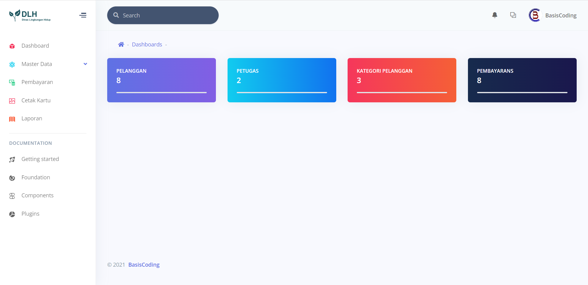
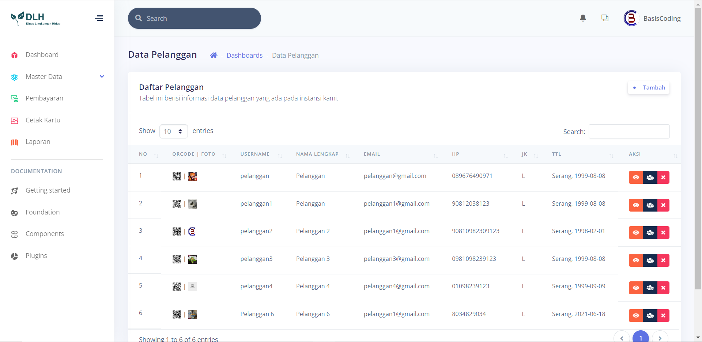
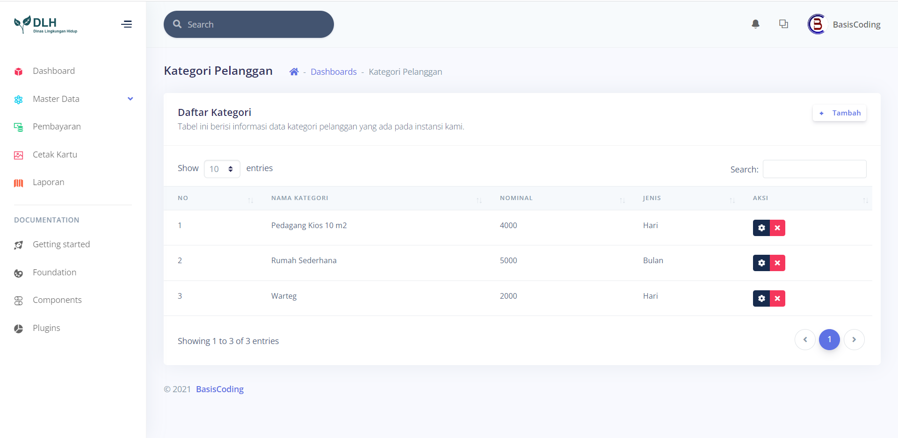
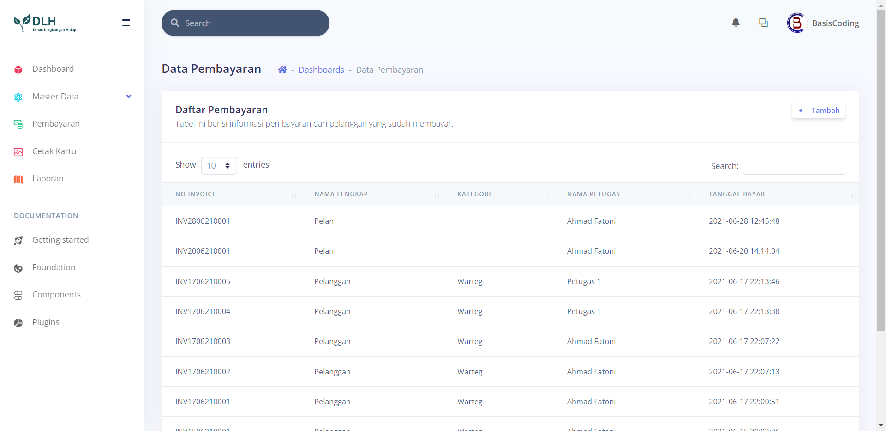
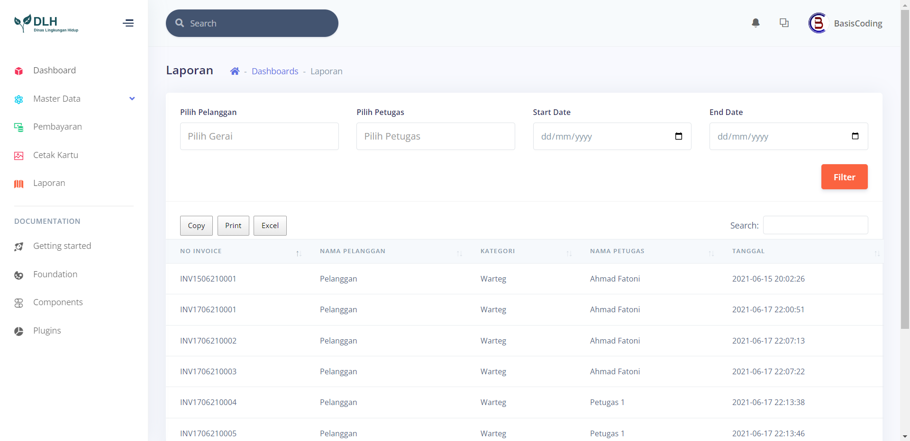
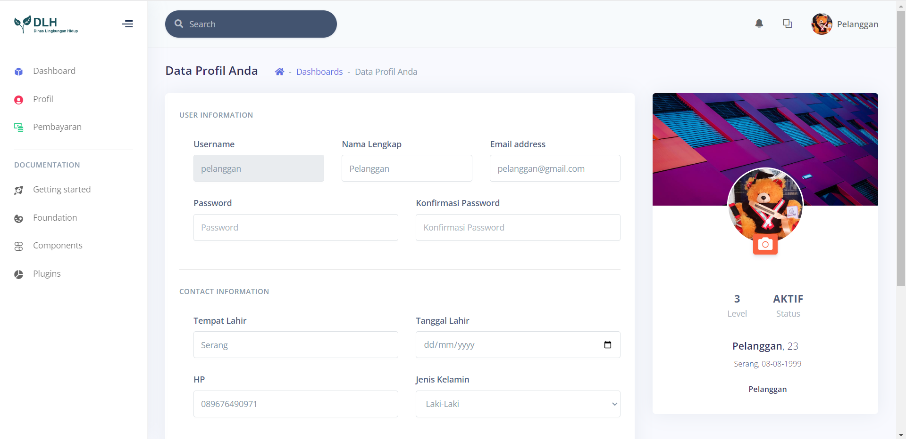
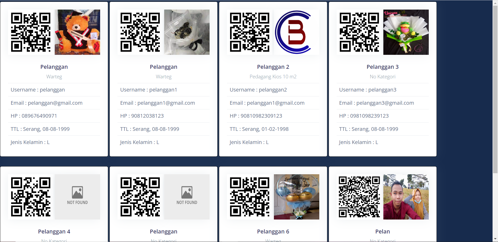
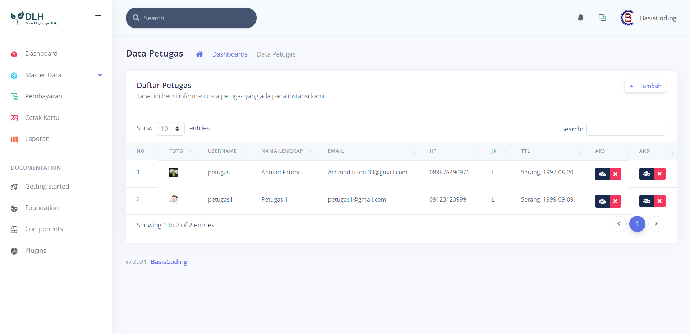
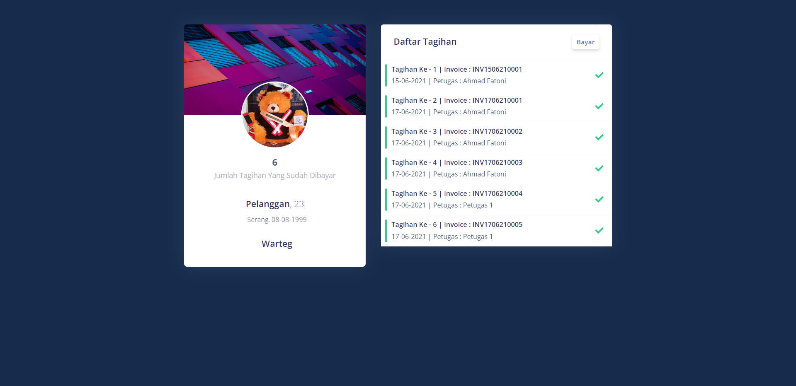

# Sistem Informasi Dinas Lingkungan Hidup (SDLH)

Aplikasi ini bertujuan untuk mengelola pembayaran kebersihan dari pelanggan yang terdaftar pada Dinas Lingkungan Hidup. Terdapat beberapa fitur yang mencakup aspek administrasi dan pembayaran.

## Fitur

1. **Dashboard**: Ringkasan visual dari statistik dan informasi penting.
2. **Data Pelanggan**: Manajemen data pelanggan yang terdaftar.
3. **Kategori Pelanggan**: Pengelolaan kategori pelanggan berdasarkan jenis usaha atau ukuran.
4. **Data Pembayaran**: Rekap pembayaran kebersihan secara keseluruhan.
5. **Data Pembayaran (Pelanggan)**: Histori pembayaran untuk setiap pelanggan.
6. **Profil Pembayaran**: Detail informasi tentang pelanggan.
7. **Cetak Kartu Pelanggan**: Pembuatan kartu identitas untuk pelanggan.
8. **Data Petugas**: Manajemen data petugas yang bertanggung jawab.
9. **Laporan**: Pembuatan laporan mengenai pembayaran dan aktivitas lainnya.
10. **Pembayaran Via QRCode**: Sistem pembayaran menggunakan QRCode untuk kemudahan transaksi.

## Screenshot

### 1. Dashboard

### 2. Data Pelanggan

### 3. Kategori Pelanggan

### 4. Data Pembayaran

### 5. Data Pembayaran (Pelanggan)

### 6. Profil Pembayaran

### 7. Cetak Kartu Pelanggan

### 8. Data Petugas

### 9. Laporan

### 10. Pembayaran Via QRCode

## Instalasi

1. Clone repositori ini: `git clone https://github.com/inotechno/sdlh.git`
2. Impor struktur database dari `sdlh.sql`.
3. Konfigurasi file `application/config/database.php` untuk pengaturan koneksi database.

## Role Akses

1. **Admin**: Akses penuh ke semua fitur aplikasi.
2. **Kepala Dinas**: Akses terbatas sesuai dengan tanggung jawab kepala dinas.
3. **Pelanggan**: Akses terbatas untuk melihat dan mengelola informasi pribadi serta pembayaran.
4. **Petugas**: Akses untuk melihat dan mengelola data pelanggan, pembayaran, dan laporan.

## Kontribusi

Proyek ini terbuka untuk kontribusi. Jika Anda tertarik untuk berkontribusi atau melaporkan masalah, silakan buka issue atau pull request. Kami menyambut kontribusi Anda.

## Lisensi

Diberikan di bawah lisensi MIT - Lihat [LICENSE](LICENSE) untuk lebih lanjut.
